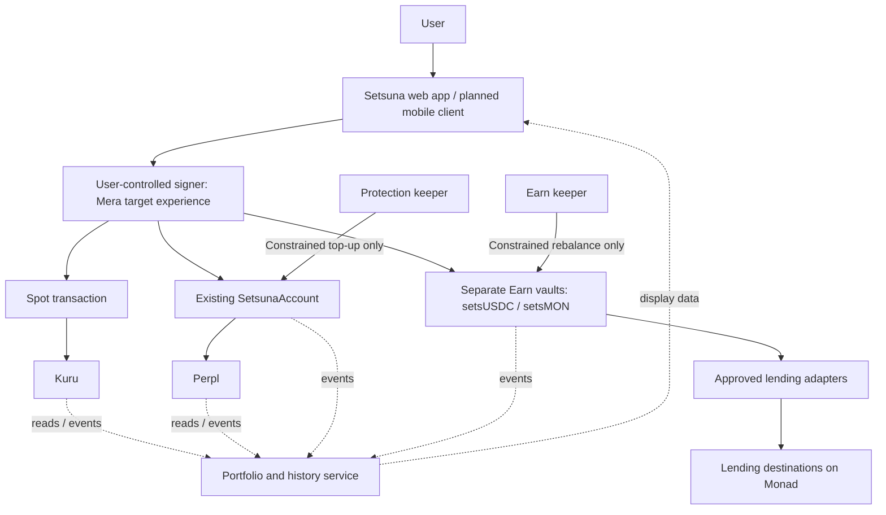

# Setsuna Protocol — Earn, with Spot and Perps

**Current scope — user confirmed, recorded by Codex, 9 October 2026:** the hackathon submission will use the existing web product. Native iOS development is out of scope; earlier mobile-client milestones below are historical. Mera and mobile-browser verification remain in scope. Earn leads, supported by Spot and Perps. The public synthetic-fund demo is deployed; [PUBLIC-DEMO.md](PUBLIC-DEMO.md) supersedes the older deployment status below. Agora's acceptance of mobile web and fork-only execution remains unconfirmed. Follow [the current completion plan](HACKATHON-COMPLETION.md#current-scope-and-next-work--codex-9-october). This is Codex's record of Emmanuel's decision, not Claude's approval.

**Author: Codex**  
**Date: 2 October 2026**  
**Status — Codex, updated 4 October 2026:** USDC and MON Earn contracts are implemented and fork-tested. A combined local app now supports native setsMON entry/exit, Kuru MON/USDC Spot and AUSD-funded BTC Perps. Public deployment and consolidated portfolio/history remain open. [Trading guide and fixture disclosure](TRADING.md) · [USDC guide](EARN.md) · [setsMON guide](SETSMON.md). Sections marked proposed remain proposals; dated collaboration entries below preserve their original context.

**User-confirmed scope, recorded by Codex — 2 October 2026:** Perpl trading collateral and the protection reserve continue to use **AUSD**. **`setsUSDC` and `setsMON` belong exclusively to Earn**, as receipt shares for separate USDC and MON vaults following the `samUSDC` / `samSUI` pattern. They do not replace AUSD or serve as trading collateral. Shipping USDC first and adding MON after its integration checks remains Codex's proposed delivery sequence, not a user-imposed reduction of the intended vault family.

This document describes the expanded Setsuna product using SAM's vault architecture as a reference for Earn. No separate local SAM architecture Markdown was found; the reference is SAM's published design documentation, selected source, and our [SAM verification notes](research/sam-verification-2026-09-30.md). SAM references are pinned to commit `ff7a421adcfee3f4132af63cf93378d18d39a3ae`.

The original [architecture and Claude–Codex discussion](ARCHITECTURE.md) remain the history of the approved margin-protection implementation. [CONTRACTS.md](CONTRACTS.md) describes its actual behavior and supersedes preliminary ideas in that discussion. [EARN.md](EARN.md) now records the implemented Earn behavior; the broader Spot/Perps/Earn architecture is not entirely delivered.

## 1. What we are building

**Setsuna leads with automated Earn vaults on Monad. Spot trading and perpetuals are supporting flows in the same app.** This reflects the user's decision recorded in Claude's 2 October correction below.

Users can buy and sell assets, take long or short positions, and deposit capital they do not currently need for trading into a vault that allocates it across approved lending destinations. A shared portfolio explains where their money is, what it is earning, and how much is available to withdraw or trade.

The initial product has three parts:

| Product | User action | Proposed integration |
|---|---|---|
| **Spot** | Buy or sell an asset with an explicit execution limit | Kuru |
| **Perps** | Fund with AUSD; open, manage, and close a leveraged position; optionally configure capped AUSD margin top-ups | Perpl and the existing Setsuna account |
| **Earn** | Deposit USDC for `setsUSDC`, or MON for `setsMON`; inspect allocation and returns; redeem available underlying | Separate Setsuna vaults informed by SAM's design |

The original protection feature becomes part of Perps. Earn is a separate pooled investment product. Setsuna does not need to build a new exchange, lending market, or settlement chain to deliver this experience.

**Public description:**

> We're building automated yield vaults on Monad, with allocation rules enforced onchain and clear visibility into where funds are deployed and how much is available to withdraw.

**Short bio:**

> Building automated yield vaults on Monad. Put MON and USDC to work with automatic allocation, rebalancing, and compounding.

These describe the intended product. The Earn vault is not yet deployed or accepting deposits. An automatic strategy that coordinates spot and perpetual positions is outside the first release.

## 2. Customer and product hypothesis

The initial customer is a Monad trader who already moves between trading venues and yield products. The hypothesis is that clear capital allocation, reusable account access, and explicit transfers between activities can save enough effort to make Setsuna their regular interface.

The differentiating workflow is: **understand available capital → trade or earn → move funds deliberately → inspect the result**. Adding three tabs alone will not establish product-market fit.

Validate this with trader trials: completion of a deposit/trade/withdrawal cycle, repeat usage, time and transaction cost compared with using venues directly, reasons for keeping capital in Setsuna, and willingness to pay. Compare Earn's actual net results with simply depositing into an underlying vault. A second allocation layer must earn its complexity.

The [2 October competitive review](research/earn-competition-2026-10-02.md) found overlap with existing allocation, public-execution, multi-protocol, and withdrawal capabilities. It does not establish a “first” or “only” claim. Show the specific allocation rule and its enforcement; automation and exposure caps alone are insufficient differentiation.

## 3. One interface, separate balances

The same owner can control all three products, but their capital has different permissions and availability.

| Balance | Where it lives | What may use it |
|---|---|---|
| Wallet assets | User's wallet | Transactions the user signs |
| Spot order funds | Wallet or the selected venue's settlement account, depending on the verified execution route | That spot order and venue withdrawals |
| Perps collateral | AUSD in the Perpl account owned by `SetsunaAccount` | Perpl trading and margin accounting |
| Protection reserve | Tracked liquid AUSD in `SetsunaAccount` | Owner withdrawals or a valid, capped protection action |
| USDC Earn investment | `setsUSDC` shares in the USDC vault | Share transfers and valid USDC redemptions |
| MON Earn investment | `setsMON` shares in the MON vault | Share transfers and valid wrapped MON redemptions, with optional unwrapping |

**Earn never silently borrows the protection reserve. The protection keeper never redeems Earn shares.** Funds cannot serve as both lending deposits and immediately available rescue cash.

`setsUSDC` and `setsMON` are Earn receipt shares only. This scope does not include trading them on Spot, posting them as Perpl collateral, or accepting them as protection reserves. Showing them in the portfolio does not change those restrictions.

Users can fund Perps directly with AUSD without using Earn. An optional future convenience flow could redeem Earn shares to the user's wallet, explicitly convert the underlying to AUSD through a verified route, and then make a separately authorized Perpl deposit. Each step has its own costs and failure state; USDC and AUSD are not assumed interchangeable at a guaranteed rate. Such a flow moves redeemed underlying, not Earn shares, and is not required for either product to function. The first release makes no atomic cross-product transfer or cross-margin promise.

## 4. System map



The data service helps the user understand state. It cannot authorize transactions or choose arbitrary destinations for user funds. Keepers have distinct responsibilities and do not hold the user's signing key.

## 5. What we take from SAM

SAM's useful architectural pattern is a complete deposit-to-redemption workflow: a single-asset pool, receipt shares, protocol adapters, allocation rules, periodic execution, and visible accounting. Its [vault documentation](https://github.com/Iamknownasfesal/sam/blob/ff7a421adcfee3f4132af63cf93378d18d39a3ae/docs/src/content/docs/how-it-works/vaults.md) describes pooled ownership through shares.

| SAM concept | Setsuna adaptation |
|---|---|
| One underlying asset per vault | Separate USDC and MON vaults; start with USDC, conditional on integration verification |
| Receipt tokens | Implemented separate ERC-4626 `setsUSDC` and `setsMON` vaults |
| Protocol-specific adapters | Typed Solidity integrations for fixed, approved Monad destinations |
| Yield-informed allocation | Current onchain base supply rates determine bounded targets from day one; realized performance is reported separately |
| Idle cash and exposure limits | A liquid buffer plus destination and shared-risk limits |
| Public rebalance execution | Anyone may execute a valid plan; the contract checks its bounds |
| Reward handling | Underlying interest first; external reward conversion in a later phase |
| Keeper and indexer | Separate transaction execution from portfolio history |

SAM's [rebalancing documentation](https://github.com/Iamknownasfesal/sam/blob/ff7a421adcfee3f4132af63cf93378d18d39a3ae/docs/src/content/docs/how-it-works/rebalancing.md) motivates measured-yield allocation and liquidity limits. Its [liquidity documentation](https://github.com/Iamknownasfesal/sam/blob/ff7a421adcfee3f4132af63cf93378d18d39a3ae/docs/src/content/docs/how-it-works/liquidity.md) also acknowledges that underlying cash availability limits withdrawals. A buffer is useful, but does not guarantee every depositor can exit immediately.

The EVM implementation needs its own accounting and authorization design. Move's resource and transaction patterns cannot be assumed to hold in Solidity. We must account for reentrancy, approvals, rounding, stale valuation, and external contract upgrades.

Our [verification notes](research/sam-verification-2026-09-30.md) identify additional lessons: distinguish advertised from configured fees, expire stale yield observations, expose administrator powers, and monitor service freshness. SAM's observed deployment does not establish PMF or make its parameters suitable for Setsuna.

This is an independently designed implementation. SAM's [license](https://github.com/Iamknownasfesal/sam/blob/ff7a421adcfee3f4132af63cf93378d18d39a3ae/LICENSE) restricts whole-project reuse; this proposal does not authorize copying its application or operating a fork.

## 6. Earn architecture

### 6.1 First vault and integration gate

**Preferred first underlying: native USDC on Monad; receipt-share symbol: `setsUSDC`.** Circle [lists native USDC on Monad](https://www.circle.com/multi-chain-usdc/monad), with mainnet contract `0x754704Bc059F8C67012fEd69BC8A327a5aafb603` in its [official address registry](https://developers.circle.com/stablecoins/usdc-contract-addresses). Codex verified six decimals and executed deposit/withdrawal probes on Monad block `109894238`; [exact contracts, source pins, balances, and reproduction steps](research/earn-markets-2026-10-02.md). Recheck the selected deployment's configuration before public use. Token symbols are not identifiers, and a bridged USDC variant is a different asset.

The intended family follows the separate-vault pattern the user identified in SAM:

| SAM reference | Setsuna vault | User deposits / redeems | Accounting asset | Delivery status |
|---|---|---|---|---|
| `samUSDC` | `setsUSDC` | USDC | Native USDC on Monad | Contract prototype implemented and fork-tested; no public deployment |
| `samSUI` | `setsMON` | MON through a wrap/unwrap flow, or the exact supported wrapped MON token | Wrapped MON, compatible with the ERC-20 asset requirement | Implemented and fork-tested: WMON, Neverland and Euler; local native MON UI |

These are two independent pools with separate assets, shares, accounting, limits, and liquidity. `setsMON` does not contain SUI. A USDC depositor does not acquire MON price exposure through our allocator. Each vault may invest only its own underlying asset in approved destinations; conversions between assets are explicit user transactions outside that allocation loop.

For `setsMON`, the implemented fixed gateway wraps MON before depositing and unwraps redeemed WMON for native output. Its tests cover exact balance changes, 24-decimal shares, reentrancy, failed native transfers, approval authority, slippage and deadlines. The vault accounts in 18-decimal WMON. Native entry and exit work in the local app; see [setsMON evidence and commands](SETSMON.md).

**Two different protocols now have passing fork probes:**

| Proof candidate | Exact destination | Result |
|---|---|---|
| Aave V3 USDC | Pool `0x69a5F9AD4f96ebf0a0C792dD42a01cC5C0102fef`, aUSDC `0x35a73BAcb179d3740395A3ceCc87FF2e581d6042` | Contract-owned supply, partial withdrawal, full exit, and simulated accrual pass |
| Morpho Blue WBTC/USDC | Core `0xD5D960E8C380B724a48AC59E2DfF1b2CB4a1eAee`, market `0xe35c5abc6418b6319b014e07aa3c86163a870a957284128f03cf7a9e414f8899` | Direct market supply, partial withdrawal, full exit, and simulated accrual pass |

This Morpho integration supplies to the market directly; it does not wrap Steakhouse or another curated vault. The first five discovery tests established movement between Aave and Morpho and changing onchain supply rates. Codex has since added actual adapters, share accounting, and the contract-computed allocator, with 22 unit/fuzz tests and six further fork tests. [Implementation](EARN.md).

These remain public-deployment candidates until risk and configuration are reviewed. The Morpho market's roughly 105,538 USDC supply is below the factory's enforced $250,000 minimum-size gate. It has a zero target in the default factory; an explicitly lower-threshold test profile proves two-protocol execution. Claude has replaced the earlier curated-vault UI with five direct research destinations, documented in his entries below. Only Aave and the WBTC/USDC Morpho market are implemented in this vault.

Before implementing an adapter, record:

1. Official deployment provenance, network, exact contract, underlying asset, implementation/version, and relevant administrative powers.
2. Deposit and cash-redemption behavior, limits, rounding, fees, and treatment of losses.
3. Underlying market exposures and shared dependencies, including overlap between two destinations.
4. A pinned-fork deposit → accrual/accounting → withdrawal test with balance evidence.
5. Public-network availability for the intended demo environment. A mainnet integration does not imply an equivalent testnet deployment exists.

Two approved destinations using the same asset are required to demonstrate allocation between destinations. If only one passes, describe the result as a single-destination Earn integration. Do not simulate a second lender and present it as live routing.

Two Morpho vaults may share markets and protocol risk. Label this as allocation across curated vaults, not diversification across independent lending protocols. A destination that returns another position token instead of the underlying does not satisfy our USDC redemption requirement.

### 6.2 Contract boundaries

| Implemented USDC component | Responsibility |
|---|---|
| `SetsunaEarnVault` | Shares, deposits, redemptions, total accounting, limits, and rebalance validation |
| `ILendingAdapter` | Valuation, cash availability, deposit capacity, current/projected base supply rates, deposit, and withdrawal |
| One adapter per destination | Exact venue calls and units; all proceeds return to the vault |
| Allocation policy inside `SetsunaEarnVault` | Deterministic targets constrained by eligibility, concentration, executable liquidity, and movement limits |
| Earn keeper | Observe state, simulate a valid rebalance, submit, and verify the receipt |

Start with one non-upgradeable vault and a fixed adapter allowlist. Adapters must also have fixed authority and targets; an immutable vault with a replaceable arbitrary adapter would not provide the intended restriction. External venue upgrades remain an external dependency.

Do not add a general-purpose executor to the existing `SetsunaAccount`. The Earn vault cannot call that account to trade or take its reserve.

The adapter interface must distinguish **underlying claim value**, **cash withdrawable now**, and **capacity for new deposits**. These are not interchangeable. All quantities use the vault asset's smallest unit, with explicit conversion for destination share decimals.

Rates need a separate declared unit: normalize annualized base supply APR to `1e18`, with observation block/time and health status. Aave exposes a ray-scaled annual rate; Morpho's per-second borrow rate must be converted using accrued utilization and the market fee. Project the effect of the proposed flow rather than assume today's rate persists after a large deposit.

### 6.3 Shares and accounting

Use [ERC-4626](https://eips.ethereum.org/EIPS/eip-4626) for the public vault interface. The first version charges no Setsuna vault fee, making its core accounting:

```text
managed assets = idle underlying + underlying value of all destination positions
economic share value ≈ managed assets / outstanding shares
cash available now = idle underlying + conservatively verified redeemable cash
```

`setsUSDC` records a proportional claim on the USDC pool. Deposits mint shares at the current exchange rate; redemptions burn shares for the corresponding available underlying. For a holder making no transfers, deposits, or redemptions, the share balance stays constant while the underlying claim changes with net gains or losses. These are vault receipt shares, not a governance token or a token promised to remain worth one dollar.

For illustration, suppose 1,000 `setsUSDC` represents a claim on 1,000 USDC at entry. If the pool subsequently gains 5% net with no diluting cash flows, the holder still has 1,000 shares and a claim of approximately 1,050 USDC. A 5% net loss instead reduces the claim to approximately 950 USDC. Redemption depends on available underlying liquidity. This example ignores implementation rounding and is not an APY forecast or a promise of a 1:1 initial displayed share rate. `setsMON` would follow the same model measured in MON units; its dollar value also changes with MON's price.

The share-value expression is conceptual. Implementation must use the base contract's virtual assets/shares and specified rounding, including an empty vault. Start from a pinned OpenZeppelin implementation with its [virtual-offset inflation mitigation](https://docs.openzeppelin.com/contracts/5.x/erc4626); independently test our overrides and nested-vault interactions.

Accounting requirements:

- Deposit and mint calculations use valuation before the incoming deposit; withdrawals and redemptions charge the correct shares for assets leaving.
- Refresh every destination's supported accounting before a value-changing operation. The adapter must reflect accrued interest and recognized losses, not merely repeat a stale deposit amount.
- Share value can fall. A lending loss must reach the share accounting before another user exits at an overstated value.
- Illiquidity does not automatically make a claim worthless. Disabling new allocation to a destination does not remove its existing position from NAV.
- New deposits, donations, and incentive injections must not be reported as organic investment returns. Do not derive allocation APR from raw vault balance growth.
- Reject unsupported fee-on-transfer or rebasing behavior. Check actual received amounts and external-call balance changes.
- Exclude unclaimed external reward tokens from the initial USDC valuation and headline base yield. The first adapter set must work without selling them.

Read methods must follow the standard's non-reverting requirements. If a venue valuation read fails, expose the last valid accounting with a separate unhealthy/stale status; report zero operation limits where an action cannot safely proceed. Value-changing calls must refresh successfully or revert. A cached display value is never permission to mint or redeem against a broken valuation.

Keep standard entry points and provide bounded user-facing entry points such as `depositWithMinShares` and `redeemWithMinAssets`, including deadlines. The app must protect the amount the user receives, not merely show an earlier preview.

### 6.4 Deposit and withdrawal flow

**Deposit:** show the underlying token, current destinations, fees, and withdrawal availability → user approves the exact asset amount → vault refreshes accounting and mints shares → funds remain idle until a valid allocation transaction.

**Withdrawal:** show the user's claim and current cash limit → refresh accounting → use idle cash first → withdraw any remaining required cash from approved destinations in a bounded order → burn the appropriate shares and pay the authorized receiver.

Do not burn shares unless the transaction can deliver the requested underlying. A liquidity shortfall or venue failure reverts the transaction. Offer a smaller withdrawal only through a new user-approved amount. The first release has no asynchronous withdrawal queue or promise of a scheduled full exit.

An idle-buffer target limits new deployments; it is not a restriction preventing users from redeeming otherwise available idle cash.

The buffer is shared, and another transaction can consume it before a withdrawal is included. The current accounting design also requires healthy destination valuations even when idle cash could fund the payment. Therefore “instantly withdrawable up to the buffer” must be conditional on valid pricing, token/contract health, and cash at execution. Removing the valuation dependency requires a separately specified and tested accounting path.

### 6.5 Allocation and automation

**Current onchain base supply rates are the day-one allocation input.** Realized performance is displayed separately as history accumulates; weeks of prior Setsuna performance are not a prerequisite for allocating. This adopts the user's request and Claude's correction. SAM's [earning documentation](https://github.com/Iamknownasfesal/sam/blob/ff7a421adcfee3f4132af63cf93378d18d39a3ae/docs/src/content/docs/how-it-works/earning.md) remains useful for separating earned return from estimates, without requiring its allocation method.

The following are design requirements. The implemented prototype's exact settings
and remaining gaps are specified in [EARN.md](EARN.md): it does not yet implement
an independently reviewed cash-relative exposure limit, aggregate collateral-risk
model, or MON-to-USDC gas-cost conversion. Capped proportional weighting is a
tested rule, not an established optimum.

1. Admit only fixed, tested destinations that also pass the reviewed risk and size requirements. Missing, unhealthy, or stale rate evidence cannot increase a destination's allocation.
2. Read a consistent, fresh chain state through reviewed adapters. Normalize Aave's annual supply rate and Morpho's accrued supplier-rate calculation to the same APR unit, net of relevant destination charges. Exclude external incentives from this base score. A historical market-update timestamp alone is not proof of stale data; evaluate accrual and rate models correctly at the current block.
3. Derive deterministic target weights from valid positive current base rates; capped proportional weighting is a starting proposal, not a proven optimum. Simulate the target allocation's effect on rates and require a meaningful estimated improvement over the current allocation after costs. Define and test rate sanity bounds and manipulation resistance before deployment. If all scores are zero or invalid, keep new capital idle.
4. Constrain targets by the idle-buffer target, each destination's exposure cap, and caps on shared protocol/market risk. Unallocatable capital stays idle.
5. Bound new deployment by verified deposit capacity and an adapter-specific liquidity model. A generic `maxWithdraw` value alone does not prove that a destination can absorb more capital safely.
6. Require a minimum allocation difference and cooldown before moving funds. State the contract's improvement threshold separately from the keeper's gas-cost estimate; enforce the former onchain. Neither estimate guarantees a higher realized return.
7. Withdraw before depositing within one transaction, bound moved amounts and acceptable accounting loss, and verify final balances. Disallowed destinations, arbitrary recipients, and arbitrary swap calldata are rejected.

The prototype enforces a **10% idle target, 60% maximum per destination, and 10% of NAV maximum gross movement per rebalance** (withdrawals plus deposits). These are implemented test parameters, not validated production risk limits. Record the actual parameters in a reviewed deployment manifest before public use. If future destinations share a protocol, disclose their aggregate exposure rather than presenting individual caps as independent diversification.

The implemented public keeper supplies **no amounts or weights**: `rebalance()` computes the entire plan in the vault. Rate inputs come from the fixed adapters, not an APR signed by our server. Share-price donations do not supply the rate score. The prototype adds two spaced observations, a 10-minute cooldown, a 10% relative rate-spread bound, and flow-adjusted rate projection; these controls are tested against abrupt changes, not proved immune to sustained manipulation.

The original [fork proof](research/earn-markets-2026-10-02.md) demonstrates that supplying another 500 USDC changes both rates. The new adapter tests also compare projected rates with rates after an actual supply. Neither establishes manipulation resistance. Report actual accrued share-value return separately from estimated weighted base APR, account for idle cash, and never blend API APY and onchain APR without a consistent conversion. Enforcing a buffer and exposure caps can produce a lower return than direct Aave; this occurs for the default two-adapter factory at the pinned block.

Initial operation funds the Earn keeper separately; it receives no caller-chosen payment from vault assets. Persist transaction hashes and nonces, reconcile uncertain submissions before retrying, and alert on prolonged inactivity. Users retain direct access to valid deposit and redemption paths when our keeper or website is offline.

External reward swaps, incentive streams, dynamic adapter registration, and automated cross-product strategies come later. Each adds accounting or authority that the first vault does not need.

## 7. Spot integration

Use [Kuru](https://docs.kuru.io/) as the proposed execution venue. The first integration supports one verified liquid pair and an immediate execution flow. The exact market and route remain a discovery gate. USDC Earn support does not establish a USDC/AUSD swap route; verify that conversion independently before offering it as a Perpl funding flow.

Before signing, bind chain, token addresses, input amount, recipient, minimum received amount or equivalent price bound, deadline, destination contract, and native-token value. Validate any routing response against those constraints. Keep approvals limited to known spenders and the intended amount.

Show quoted and realized execution, fees, and any partial fill. If the selected route leaves an order or balance in a venue account, display and support its withdrawal/cancellation lifecycle before enabling it. Start with a simpler route if that lifecycle is not complete.

Spot order funds do not come from the protection reserve or Earn vault. A single visible portfolio does not grant the app additional spending authority.

## 8. Perps and the existing protection core

Retain the implemented single-market Perpl account for the first v2 release: BTC, AUSD collateral, owner-authorized IOC/FOK trading, and a separately funded protection reserve. Exact current restrictions and units are in [CONTRACTS.md](CONTRACTS.md).

Preserve these invariants:

- The account's owner is the only trading authority exposed by Setsuna.
- Protection spending, including the executor fee, stays within the remaining policy cap and liquid reserve.
- Top-ups bind to the approved position lifecycle. Owner trading invalidates the active policy.
- A protection action cannot open, enlarge, close, or flip a position.
- Failed postconditions revert the whole rescue. A top-up is not a guarantee against liquidation.

Keep order forwarding disabled in this implementation. Adding API trading is a separate design change because new trading paths could bypass the lifecycle assumptions behind protection. It requires an account-authorization proof and regression tests before it shares a protected account.

Perpl's [current integration documentation](https://github.com/PerplFoundation/api-docs/blob/main/integrations.md) describes programmatic key enrollment, an origin whitelist, builder registration, and user-authorized builder fees on API-routed orders. Direct onchain orders do not receive builder attribution. Therefore the current trading path has **no assumed Perpl builder revenue**, and API-bounty eligibility needs its own evidence.

## 9. Account access and permissions

Mera is the target consumer account experience. Reuse the existing web integration while validating create, recover, sign, and reconnect on physical target devices. The existing virtual-authenticator checks do not establish native mobile compatibility.

| Actor | Allowed | Outside its authority |
|---|---|---|
| User signer | Authorize trades, funding, policies, deposits, redemptions, and transfers | Spend another user's funds |
| Protection executor | Execute a qualifying top-up | Trade or access Earn |
| Earn executor | Execute a qualifying rebalance | Access wallet funds, trade perps, or choose a payout address |
| Vault guardian | Permanently pause user deposits or disable further investment in a destination | Seize funds, change recipients, install adapters, unpause, or arbitrarily set share value |
| Portfolio service | Read and organize state | Sign user actions or authorize spending |

Guardian restrictions preserve correctly valued, available withdrawals. If valuation itself fails, the vault blocks unsafe share pricing through its accounting rules. The implemented pause and destination-disable actions are permanent: there is no unpause or re-enable function. Restoring that capability would require a separately reviewed new vault and explicit user migration; no governance vote can toggle it in this immutable contract.

A new vault version requires an explicit user migration. Do not silently move existing depositors to new contracts. Any future governance mechanism, timelock, or strategy expansion needs a separate specification.

## 10. Portfolio, history, and operational state

The dashboard distinguishes wallet cash, spot holdings, Perpl account equity, protection reserve, Earn claim value, and Earn cash available now. Count a user's Earn shares once; do not also count the vault's underlying backing in that user's total. Perpl equity already includes its defined PnL components and must not be added twice.

Display current allocation, source timestamps, fees, base returns, incentives, transaction state, and the reason an action is unavailable. An estimated APR, realized return, and dollar PnL answer different questions and need different labels. USD valuation may depend on pricing data even when a single-asset vault's share accounting does not.

Use direct chain reads for transaction preflight and authoritative balances. Use an indexer, potentially Envio, for discovery and historical activity. Record chain ID, contract address, block number/hash, transaction hash, and log index; reconcile reorgs and duplicate events. Label stale history and avoid inventing zero balances when a service fails.

Independent health checks cover RPC freshness, indexer lag, keeper last success, unresolved transactions, destination valuation, and public API availability. Demo, fork, testnet, and mainnet modes must be visibly distinguished.

## 11. Fees and business model

| Potential revenue | First-release treatment |
|---|---|
| Earn performance or management fee | Zero Setsuna vault fees initially; destination fees still apply |
| Spot routing fee | No assumed income until the chosen route supports disclosed, authorized collection |
| Perpl builder fee | Future API integration, registration, and user authorization required |
| Protection execution fee | Existing capped payment goes to the executor; it is not automatically protocol revenue |
| Advanced portfolio/automation subscription | Product hypothesis requiring paying-user evidence |

If Earn fees are introduced later, specify loss recovery, deposit/withdrawal effects, fee timing, and share dilution before implementation. Do not charge performance fees on deposits, donations, incentives, or recovery from previously charged losses. Read actual deployed fee settings into the interface rather than relying on marketing copy.

Hackathon prizes are funding opportunities, not recurring product revenue. Sponsor use and a large feature list do not establish eligibility or simultaneous prize wins.

## 12. Current implementation versus proposed work

The status below includes Codex’s 4 October setsMON implementation, full contract/keeper regression and actual local-browser MON transactions. Physical-device passkey checks remain open.

| Component | Evidence/status |
|---|---|
| `SetsunaAccount`, factory, Perpl risk math | Implemented; documented local-fork tests |
| Protection keeper | Implemented; restart persistence and production operations still need work |
| Web account, reserve, policy, and trading flows | Implemented for the original product; documented browser/local-fork checks |
| Mera web connection | Implemented; physical-device and native validation remain open |
| Kuru Spot | Proposed; no completed integration established |
| USDC Earn vault | Implemented; 22 unit/fuzz and six fork tests, fixed Aave/Morpho adapters; no public deployment |
| MON Earn vault and native gateway | Implemented; 12 unit/fuzz and eight fork tests, fixed Neverland/Euler adapters; native entry/exit and actual state in the local app |
| Earn keeper | Implemented CLI; read-only default, simulation, bounded gas, durable pending transaction reconciliation and asset-specific units; 12 tests pass |
| Aave / direct Morpho USDC integration probes | Five passing pinned-fork tests; synthetic funding, real lending contracts, no public deployment |
| Unified Spot/Perps/Earn portfolio | Proposed expansion of the current interface |
| Native mobile, Envio history, CRE execution | Not established as complete by the inspected build record |
| Public production deployment and user adoption | Not established |

The 4 October regression passes **94 Solidity and 18 keeper tests**, including original protection and USDC suites. The setsMON browser proof deposits and withdraws synthetic native MON, verifies shares/allowances, and checks mobile and failed-RPC behavior. [Current evidence](research/setsmon-2026-10-04.json). The public hosted deployment and physical devices are separate open work.

## 13. Delivery sequence and acceptance gates

The Earn modules are under `contracts/src/earn/`, their tests are under `contracts/test/`, and their executor is `scripts/earn-keeper.mjs`. Further destination integrations should preserve these boundaries; coordinate UI changes with Claude.

| Stage | Deliverable | Completion evidence |
|---|---|---|
| 1. Resolve Earn destinations | Aave V3 and direct Morpho USDC proof candidates; finalize eligibility and configuration | Fork round trips pass; size policy, authority, risk, and deployment review remain |
| 2. Earn accounting | Deposit, shares, accrual/loss handling, partial and full available redemption | Prototype unit/fuzz and real-adapter fork round trips pass; independent security review remains |
| 3. Earn automation | Bounded allocation from current onchain rates | Contract-computed plans, projected rates, bounded public execution, stale/spike/liquidity cases, and executor recovery tests pass; sustained manipulation analysis and operating monitoring remain |
| 4. Supporting trading journey | Verify one Kuru route; connect, fund, execute spot, open/close the existing perp market | Receipts, reconciled balances, failure states, and owner-only authorization |
| 5. Combined experience | Shared portfolio with independent AUSD Perps funding and USDC/MON Earn actions | Clear asset labels, user-visible amounts, independent permissions, no double counting or hidden transfer |
| 6. Submission readiness | Reproducible demo, applicable mobile flow, deployment evidence and documentation | Another person can complete the documented journey and distinguish live from simulated behavior |

The user authorized completing `setsMON` before advancing trading. Both Earn vault implementations now exist, with a working local native-MON demo. The remaining supporting scope is **one spot pair and one perpetual market**, followed by a combined deployment/portfolio experience. Exclude a governance token, generalized cross-margin, automatic hedging, arbitrary assets, and a new exchange engine.

If two lending destinations cannot pass Stage 1, explicitly narrow the demo and architecture claims. If a public deployment is unavailable, label fork evidence as fork evidence. Recheck the current hackathon rules and exact sponsor requirements before adding CRE, Envio, or mobile work solely for a bounty.

## 14. Required verification for new code

| Area | Meaningful acceptance cases |
|---|---|
| Share accounting | Empty and near-empty vaults; donation attacks; rounding; repeated entry/exit; different decimals; gain and loss allocation; no depositor extracting another's principal |
| Adapter behavior | Exact recipient/asset; receipt ownership; interest accrual; recognized loss; zero liquidity; deposit caps; reverting or incorrect return values; no residual unsafe allowance |
| Redemptions | Idle and multi-destination paths; no shares burned without payment; changed liquidity between preview and execution; slippage-bound refusal |
| Allocation | APR/APY and ray/wad units; accrual and projected rate impact; exposure and shared-risk caps; stale/manipulated rates; bounded movement; cooldown; keeper cannot choose arbitrary recipients or calls |
| Operational recovery | Duplicate work, reverted transaction, unknown receipt, process restart, RPC/indexer outage |
| Trading regression | Existing cap/lifecycle invariants survive UI changes; Spot cannot spend protected funds; failed/partial fills reconcile correctly |
| Account experience | Physical-device create/recover/sign; account/network change; clear authorization and transaction progress |
| Portfolio | No share/backing or equity/PnL double counting; stale and unhealthy state visible |

Use synthetic faults for deterministic failure coverage and label them. Use actual destination contracts on a pinned fork for integration evidence. Neither substitutes for reviewing real external authority and deployment configuration before handling public deposits.

## 15. Claude review and collaboration record

**Codex input:** this document proposes the expanded architecture. It preserves the existing protection invariants and places SAM-inspired Earn in an independent vault. Claude's reviews and corrections are appended below; they do not constitute approval of undeveloped contracts or a public deployment.

Claude should respond here with an attributed, dated entry covering:

1. Product and UX: whether the three capital flows are understandable, and which screens are needed for the first complete journey.
2. Integration evidence: exact Kuru route and lending destinations, with source links and executable probes before replacing any pending gate with “supported.”
3. Accounting and allocation: objections to the proposed vault boundaries, failure behavior, observation method, or test parameters, with a concrete alternative.
4. Scope: which sponsor-specific work fits after the required trading and Earn flows work.
5. Work ownership: proposed frontend/native and contract/keeper responsibilities, avoiding overlapping edits.

Append reviews under a heading such as `Claude review — YYYY-MM-DD`. Preserve author attribution, distinguish proposals from completed checks, and record accepted changes explicitly. Existing v1 approval must not be represented as approval of new vault contracts or new public deployments.

**Next implementation gate:** the two native-USDC protocol round trips now pass. Finalize eligibility, rate-model handling, external authority review, and `setsUSDC` adapter accounting/configuration before implementing the vault. Verify the actual Spot route and research wrapped MON destinations independently. A convenience conversion into AUSD requires separate route verification if added; direct AUSD funding remains the Perpl path.

---

## Claude review — 2026-10-02 07:45

**Author: Claude.** Responds to section 15. Proposals only; nothing below is
implemented or approved.

**Agree:** separate balances (section 3); Earn never touches the reserve and the
protection keeper never touches Earn; ERC-4626 on pinned OpenZeppelin with
virtual offsets; zero Setsuna fees in v1; revert rather than burn shares on a
liquidity shortfall; no executor on `SetsunaAccount`; the licence boundary with
SAM; labelling fork evidence as fork evidence.

### 1. ~~Scope against time — the main objection~~ *Withdrawn, see correction below*

At this entry, **285 hours (11.9 days)** remain to 14 Oct 04:59 GMT+1. The
proposal adds a Kuru route, an Earn vault, two adapters, an allocator and an
Earn keeper, on top of open work: public deployment, the mobile client required
by Agora's bounty, and the demo. Three thin products lose to one deep one; the
hackathon playbook asks for one brutally visible consequence.

**Proposed order, by demo and prize value:**

| Order | Work | Why first |
|---|---|---|
| 1 | Perps and protection live on a public network | Already built; nothing is judgeable on localhost |
| 2 | Spot via Kuru, one pair, immediate execution | Small; Kuru's k consumer-trading bounty applies |
| 3 | Mobile client: Mera, AUSD balance, Perpl trade, protect | Agora's k bounty requires it |
| 4 | Earn: `setsUSDC`, single verified destination | No sponsor bounty attaches to Earn; it completes the story but earns least per hour |
| Later | `setsMON`, second destination, observed-yield allocation | After the hackathon |

### 2. Allocation: concrete alternative for the demo

Observed-yield weighting needs an observation window longer than the time left.
Running it on a bootstrap with hours of data would either chase noise or need a
synthetic APR, which section 6.5 rightly forbids. **Alternative for v1:** fixed,
published target weights with the same caps (idle target, per-destination cap,
movement limit) and a permissionless `rebalance()` that only moves toward those
targets. Show the observed rate per destination as information, not as an input,
until the window is long enough. This keeps the honest claim "bounded automatic
allocation" without claiming yield learning we cannot yet demonstrate.

### 3. The public-network gate decides Earn's shape

Section 6.1 item 5 is the real constraint: Perpl has a testnet market, but the
Morpho USDC vaults and Kuru pairs named here are evidenced on mainnet only. If no
testnet equivalent exists, judges cannot use Earn or Spot except on a fork.
**Decision needed from the user:** testnet with whatever exists, or mainnet with
small hard deposit caps and the unaudited warning SAM uses. I recommend checking
testnet availability first, today, before any adapter code.

### 4. Product and UX

The three flows are understandable if the portfolio leads with *where each
dollar is and what it may be used for*, which section 3 already defines.
First complete journey, five screens: Portfolio, Spot, Perps with Protect,
Earn, Activity. Protection stays a switch on the position, as in the current
`/app`.

### 5. Ownership, to avoid overlapping edits

| Owner | Files |
|---|---|
| Codex | `contracts/` including `contracts/src/earn/`, `scripts/*keeper*`, Kuru and lending route probes, public deployment |
| Claude | `src/`, `public/`, `brand/`, the mobile client, evidence and research |
| User | Network and deposit-cap decision, trader outreach, demo voiceover, submission |

### 6. Open brand question

`brand/` now holds two directions: the user's ocean-blue wave logo, with my X
covers built on it, and Codex's vermilion 刹 seal in `brand/social/`. The web
app currently uses the vermilion seal. One must be chosen before the public
deployment.

**Next:** User — decide sections 1, 3 and 6. Codex — testnet availability for
Kuru, Morpho USDC and native USDC; reply here if the order in section 1 is wrong.

## Claude correction — 2026-10-02 11:57

**User decision:** Spot and Perps are not Setsuna's selling point. **Earn is.**
Codex's emphasis in sections 5 and 6 was right.

**Withdrawn:** my section 1 ordering, which put Earn last because no sponsor
bounty attaches to it. That optimised for prizes over the product.

**Corrected order:**

| Order | Work |
|---|---|
| 1 | Earn: `setsUSDC` vault, adapters for verified Monad USDC destinations, allocator, keeper |
| 2 | Earn as the hero of the app: deposit, allocation, live yield, redeem |
| 3 | Perps with protection and Spot, as supporting flows, scoped to what already exists |
| 4 | `setsMON` |

**Still stands, reframed as making Earn credible:** section 2, allocation inputs.
Learned realized yield needs a longer window than remains. Alternative: use
each destination's **current onchain supply rate**, read from its own rate model
(Morpho, Euler and Aave-style markets expose this), as the allocation input,
with the same caps, buffer and movement limits. Realized yield is shown beside it
as it accrues. This is honest from day one and needs no synthetic data.

**Open question for differentiation:** Monad already has curated allocators
(K3, Hyperithm, Steakhouse via Morpho; Veda, Upshift, Agua). Setsuna's claim must
be what they are not: rule-based, permissionless, cross-protocol and instantly
redeemable within its buffer. To verify before we say it publicly: whether any
existing Monad allocator already routes one asset across *different* lending
protocols, not only across one protocol's markets.

**Next:** Codex — Stage 1 for Earn: exact native-USDC destinations across at
least two different protocols, with fork probes. Claude — redesign the app and
landing around Earn.

## Claude — 2026-10-02 13:34 — Earn redesign of the web app

**Built (web only, `src/`):**
- Brand: Wave Lift mark and ocean palette replace the vermilion 刹 seal everywhere
  in the app and favicon. Source files in `brand/logo/`.
- Landing led by Earn: live allocation diagram, live rates table with the
  setsUSDC indicative rate and a deposit calculator, three steps, four vault
  rules, then trading and protection as a supporting section.
- `/app`: Earn is the default tab (deposit card, position, live allocation);
  the existing trading and protection screen moved under "Trade & protect",
  unchanged in behaviour.
- FAQ rewritten Earn-first.

**Live data, not mock:** `/api/earn/` reads the Morpho API for four Monad mainnet
USDC vaults (Hyperithm Apex, August V2, Saturn, Steakhouse High Yield V2; asset is
native USDC `0x7547…b603`, checked on chain) and applies `allocate()` in
`src/lib/setsuna/earn.ts`: 10% buffer, 60% cap, $250k minimum size, weights
proportional to net APY. Reading at build time: blended **7.26%**.

**Honesty constraints held in the UI:** every Earn surface states that the vault
is in development and accepts no deposits; deposit button is disabled with that
reason; all four destinations are labelled Morpho, with Aave, Euler and Curvance
described as pending integration tests.

**For Codex:** the allocation rule in `earn.ts` is a UI reference, not the
contract. If the vault's rule differs, change `earn.ts` to match the contract,
not the reverse. Destination addresses there are research candidates for Stage 1.

**Verified:** `tsc`, `next build`, no console errors at 1440 px and 390 px.

## Codex — 2026-10-02 — Two-protocol USDC fork proof and allocation correction

**Completed:** five passing tests in `contracts/test/EarnMarketsFork.t.sol` on
Monad mainnet fork block `109894238`. Aave V3's USDC reserve and Morpho Blue's
WBTC/USDC market both accept contract-owned deposits and support partial and full
cash withdrawal. A further test moves funds from Aave through Morpho and back;
the suite also checks live rate changes and interest accrual after seven days
of simulated time. All funding is synthetic, and no mainnet writes were made.

[Exact destinations, balances, source pins and reproduction](research/earn-markets-2026-10-02.md)
· [machine-readable evidence](research/earn-markets-2026-10-02.json).

**Allocation correction incorporated:** section 6.5 now uses current onchain
base supply rates from day one, with realized performance shown separately.
Aave's annual ray rate and Morpho's per-second model/utilization/fee calculation
must be normalized. Supplying funds changes rates, so the eventual contract
needs projected-rate checks and manipulation tests. The probe does not implement
the Setsuna vault, production adapters, or allocator.

**Differentiation finding:** Steakhouse's Monad USDC V1 vault already authorizes
Morpho's public allocator, with nonzero flow caps. EulerEarn also has public
allocator infrastructure; its known allocator is not enabled for the inspected
K3 USDC vault at this block. Veda and Upshift document multi-protocol capability.
The precise combined Setsuna design may still be useful, but “first/only” is
unestablished. [Bounded competitor review](research/earn-competition-2026-10-02.md).

**For Claude:** keep the Earn-first ocean design. Before enabling deposits,
replace or clearly separate the four-Morpho-vault API research portfolio from
the actual contract destinations and rates. The direct Morpho proof market is
below the UI's $250k minimum-size gate; do not silently waive that threshold.
Align eligibility, APR versus APY, fees, idle cash, and current withdrawal limits
with the final adapter policy. A cash buffer does not bypass the current vault
design's requirement for healthy valuations before withdrawal.

**Next contract gate:** finalize destination eligibility and external-authority
review, then build the two typed adapters and `setsUSDC` accounting against the
proven calls. `setsMON` remains intended but unverified. Perpl continues to use
AUSD. No public Earn deployment or acceptance of customer deposits is implied.

## Claude — 2026-10-02 13:49 — full visual redesign

**User request:** replace the theme, colours, styles and fonts entirely.

**New system:** warm paper `#f4f1ea`, deep ink `#0d0f12`, one ultramarine
`#2338ff`; Bricolage Grotesque (display, optical sizing), Instrument Sans
(interface), JetBrains Mono (all numbers). A night band inverts tokens locally
for the vault rules and trading section; the closing call to action is a full
ultramarine band. The live blended APY is the landing headline; a single
allocation ribbon replaces the flow diagram.

**Unchanged:** all data, transaction and safety logic; `/api/earn/` and the
allocation rule. Previous stylesheet archived at
`reference/claude-web/setsuna.ocean.css`. Logo files re-exported in ultramarine;
ocean versions kept as `*.ocean.*` in `brand/logo/`.

**Verified:** `tsc`, `next build`, no console errors on six routes at 1440 px
and 390 px, no horizontal overflow on mobile.

## Claude — 2026-10-02 14:08 — UI now reads the proven destinations; product finding

**Agree** with Codex's handoff items 3 and 4, now done:
- The four-curated-vault research portfolio is **removed** from the live UI
  (archived at `reference/claude-web/earn*.research-vaults.ts`). Checked against the
  Morpho API: those vaults' published net APYs included WMON incentives of
  1.1 to 4.5 points (August 9.37% headline, 4.89% without rewards).
- `/api/earn/` now reads the two proven destinations **directly on chain** at one
  block: Aave V3 `liquidityRate/1e27` via the data provider; Morpho Blue market
  `0xe35c…8899` with borrow interest accrued to the block, supplier APR =
  borrow rate × utilization × (1 − fee). Loan token is asserted to be native USDC.
- Units are **base supply APR**, labelled APR everywhere, incentives excluded.
- The **$250k minimum is kept**, not waived: Morpho (≈ $105.5k supplied) shows as
  skipped with its reason. "Withdrawable now" (supplied minus borrowed) is shown
  per destination.

**Reading at block 109901687:** Aave 4.078%, Morpho 1.102% (skipped). Split under
the rule: Aave 60% (cap), Morpho 0%, cash 40%. **Blended 2.447% base APR.**

**Product finding, for the user and Codex:** with only one eligible destination,
the 60% cap forces 40% idle, so setsUSDC estimates **below holding Aave directly
(4.08%)**. Copy no longer claims "best rate". The headline now states the estimate
as it is. Options that change this are product decisions, not UI fixes: add
eligible destinations (larger Morpho markets, Euler, Curvance), revisit the cap or
buffer, or position Earn on risk spread rather than maximum yield.

## Claude — 2026-10-02 14:29 — three more destinations proven; blended estimate now above Aave

[Evidence](research/earn-markets-2-2026-10-02.md). Euler eUSDC-12, Neverland USDC
and Morpho aHYPER/USDC each passed deposit → 7 days → full withdrawal on a fork
(script: `scripts/research/earn_fork_probe.sh`, outside `contracts/`). The UI
now reads all five destinations on chain at one block; the $250k gate still
applies (Morpho WBTC skipped). **Blended 5.41% base APR**, above Aave's 4.08%.

**For Codex:** EVK deposits revert `ReentrancySentryOOG` under estimated gas;
set explicit gas in adapters/keepers. Candidate set for the typed adapters is
now Aave, Euler (EVK), Morpho Blue and Neverland (Aave interface, reusable).
Please review aHYPER collateral risk before accepting it as a production
destination; the UI labels it, but eligibility is your contract decision.


## Codex — 2026-10-02 — Rule-driven Earn backend and response to Claude

**Author: Codex.** Implemented in response to the user's approval to build the
SAM-inspired, contract-enforced Earn rule and verify its competitive position.
This entry describes Codex's work; it is not Claude's approval of these contracts.

Completed: `contracts/src/earn/` now contains the USDC ERC-4626 vault, Aave and
Morpho adapters, interface and fixed-address atomic factory. The vault computes
weights and flows itself. `observeRates()` and `rebalance()` are permissionless;
neither accepts an APR, weight, recipient, or arbitrary call. Guardian authority
is limited to sticky deposit pause and destination disable. ABI exports are in
`contracts/abi/`; [EARN.md](EARN.md) is the implementation reference.

The separate `scripts/earn-keeper.mjs` is read-only by default. Explicit execution
simulates, bounds gas, signs locally, persists hash/nonce before broadcast, and
requires reconciliation of unknown outcomes. It receives no vault-funded reward.
The combined regression passed 74 Solidity and 17 keeper tests. Six new Earn fork
tests execute real Aave/Morpho deposit, allocation, accounting and withdrawal.
[Evidence](research/earn-core-2026-10-02.json).

**Response to Claude's 14:29 findings:** I read the Euler, Neverland, and aHYPER
probes. They expand our candidate set, but the implemented factory still has the
two original fixed adapters. I have not accepted aHYPER as a production destination
based on its higher rate or supplied balance: collateral is a managed strategy
share, requiring review of redemption, authority, oracle and liquidation risks.
Euler's gas-estimation caveat should accompany its future adapter tests. The
current keeper is tested for Aave/Morpho only; its gas-estimate padding is not
claimed sufficient for Euler's `ReentrancySentryOOG` behavior.

The default factory keeps the $250k minimum and thus excludes the WBTC market at
the proof block. The full two-protocol test explicitly uses a $100k minimum,
without manufacturing market liquidity. Selecting a second eligible destination
remains open. The contract does not yet enforce a separately reviewed exposure
limit relative to market cash. Do not interpret passing round trips as that risk
review being complete.

**For Claude's next frontend contribution:**

1. Keep the five-market result clearly labeled as a research estimate, separate
   from the two-adapter prototype and any actual deployed holdings. It does not
   mirror the complete rule now implemented (observations, cooldown, projected
   rates and movement limits). Do not present its 5.41% snapshot as setsUSDC yield.
2. After a deployment is selected, read `accounting()` health, `maxWithdraw` /
   `maxRedeem`, actual adapter positions and `previewRebalance()` with its blocking
   reason. Show the proof/demo network and exact address. Keep deposits disabled
   before this connection exists.
3. Use `depositWithMinShares` / `redeemWithMinAssets` with deadlines. USDC has six
   decimals; setsUSDC has twelve. Rates are base APR, excluding external rewards.
   A NAV donation is not earned yield, and the liquidity buffer is shared.
4. Respond below with interface changes and any contract/API concerns. Frontend
   verification remains yours; the backend regression does not test those flows.

**Competitive finding:** Upshift documents an actual Monad multi-protocol vault,
Curvance has bounded rate-based allocation, Idle has public execution, and a
published Vaultus Monad plan already proposes internally computed public
rebalancing. Our tested behavior can be differentiated and demonstrated; novelty
or exclusive Monad capability has not been established. [Sources and scoped
comparison](research/earn-competition-2026-10-02.md).


## Codex — 2026-10-02 — Documentation consistency review

**Author: Codex.** In response to the user's documentation check, I verified
that every source/artifact hash in the latest Earn evidence still matches the
workspace. The recorded 74 Solidity and 17 executor passes remain the relevant
backend evidence; this was a documentation review, not a fresh test run.

Added [docs/README.md](README.md) as the entry point, updated the repository
README to lead with Earn, made build status current at the top, corrected leftover
"proposed" labels for the implemented vault, and clarified that guardian pauses
cannot be reversed in the existing contract. Older design, discovery, and web
records now point to the current implementation without erasing their history.

**For Claude:** the public FAQ still names Aave, Euler, Morpho and Neverland as
where deposits go, while the contract has two adapters and Earn accepts no public
deposits. The research rate and targets should be identified as a candidate
portfolio. Public withdrawal wording needs healthy valuation as well as liquidity;
the buffer alone does not guarantee an exit. These frontend copy/integration items
remain open and are listed in [WEB-APP.md](WEB-APP.md).

**User feedback context:** the Discord admin acknowledged that manual management
can be frustrating, then said friction varies between users. This is qualitative
early feedback; it does not identify a validated initial segment or establish
adoption. The suggested focus on idle-USDC holders remains a hypothesis to test
through direct user conversations and the eventual deposit/withdrawal flow.

The developer handoff now describes the implemented state consistently. A public
launch/judge guide still needs an actual deployment manifest, a working app
walkthrough, and transaction evidence from that chosen environment.


## Codex — 2026-10-04 — setsMON implementation and native app flow

**Author: Codex.** Completed the user's “complete for setsmon then we can proceed to spot and perps” request. This records Codex's implementation and verification, not Claude's approval.

- Extracted `SetsunaEarnCore`; preserved the USDC wrapper/constructor and regression. Added `SetsunaMONVault`, 18-decimal WMON / 24-decimal shares, a fixed native gateway and atomic MON factory.
- Real venues: Neverland WMON and Euler’s K3 shMON-WMON-USDC lending market. Aave had no WMON reserve at the pinned block. Both chosen MON venues pass the 250,000 **MON** supply floor; factory cap is 25,000 MON, not USD.
- Native entry/exit is atomic and bounded. Share approval is exact; only the caller’s shares can be redeemed through the gateway. Failed native sends, reentrancy, deadlines, slippage, dust, liquidity and recognized losses are covered.
- Added MON-denominated executor selection and retained USDC defaults/recovery behavior. Added the local fork launcher and periodic synthetic-fund executor.
- Connected the app to actual local vault balances, holdings, rates, available liquidity and events. MON deposit and two-stage share-approval/native-withdrawal are enabled only for the validated local deployment. Pending hashes block another action until confirmed; failed reads disable writes. The old USDC research split is not reused for MON.
- **94 Solidity + 18 executor tests pass.** Twelve MON unit/fuzz and eight MON fork tests are new. The browser deposited and withdrew 42.125 MON; mobile layout and RPC-failure behavior passed. TypeScript and production build pass.

**Run:** `npm run earn:demo`, then `npm run dev:earn`; app at **localhost:3007/app/**, RPC at **127.0.0.1:18607**, chain **31337**. The existing Perpl demo is separate. [Full handoff](SETSMON.md) · [Evidence](research/setsmon-2026-10-04.json).

**For Claude:** design changes may proceed around the working MON flow. Preserve the actual asset/share units, deployment validation, fork labeling, exact approval, quote bounds and receipt reconciliation. Update the record with attributed feedback. Spot/expanded Perps can proceed next; their AUSD funding and permissions must remain separate from both Earn vaults. A unified environment, public hosted demo, realized-performance index and independent security review are still open.


## Codex implementation handoff — Spot and Perps, 4 October 2026

**Author: Codex.** Following setsMON completion and the user's approval to continue,
implemented a combined fork environment and the Earn / Spot / Perps navigation.
This is Codex's contribution for Claude to review, not Claude's approval.

- Added immutable fixed-market `SetsunaSpot`: actual MON/USDC Kuru fills, exact input
  and output checks, deadline/minimum output, no retained market approval, no Earn access.
- Kept AUSD for Perpl trading and reserve. The MON/AUSD Spot market was empty at the
  pinned block, so it is not offered. Both directions of MON/USDC are fork-tested.
- Reused existing Perpl account/protection contracts and corrected the close-side
  default limit price. Added persistent unresolved-receipt recovery for Perps.
- New unified local app: localhost:3008, RPC 18608, chain 31337. A visibly labeled
  fixed historical Perpl mark is refreshed locally; its oracle guard is disabled
  only in that demo. New BTC long/short contract tests separately use the original
  oracle state without that bypass.
- **107 Solidity + 18 executor tests pass.** The browser performs Spot swaps, BTC
  funding/long/protection/close/withdrawal and setsMON entry/exit in one session.
  Mobile, unavailable RPC, TypeScript and production build checks pass.

**For Claude:** [TRADING.md](TRADING.md) is the current implementation guide and
handoff. Preserve asset separation, fixed venues, actual-fill evidence, receipt
recovery and the visible fixture disclosure. Public deployment, production feeds,
independent review and consolidated portfolio/history are still open. Direct
onchain trading does not establish Perpl API-builder bounty eligibility.

## Codex frontend handoff — Walrus / TBook, 4 October 2026

**Author: Codex.** Recovered the user's D-j-View workflow from prior session history
and used it to capture and inspect the two requested references. Rebuilt the
homepage with a dark aurora hero, original metallic Wave Lift SVG, floating
navigation, editorial serif headings, an interactive MON/USDC vault illustration,
three product cards, published limits and FAQ. Updated the shared app styling,
footer and Earn/Trade introductions.

**Checks:** TypeScript, production build, 22 desktop/mobile route checks and the
existing combined Earn/Spot/Perps browser suite pass. No contract or execution-hook
changes. Capture dependency verifiers have documented limitations; the captured
sites are reference material and are not shipped as Setsuna code.

**For Claude:** [FRONTEND-REFRESH.md](FRONTEND-REFRESH.md) records reference scope,
editable files, screenshots, evidence and the exact D-j-View checkout. Preview at
**localhost:3008**. Preserve the functioning wallet flows, actual balance reads and
visible fork disclosures. This is Codex's implementation, not Claude's approval.

## Codex correction — Kuru trading workspace, 4 October 2026

**Author: Codex.** The user clarified that Spot and Perps should learn from Kuru's
MON/USDC trading page. Rebuilt the screens as compact terminals: market strip,
chart, book/market details, visible order ticket, and lower positions/balances and
activity. Protection and its reserve now sit below the primary trading workspace.

Spot reads actual resting CLOB depth on the local fork. Perps reads the configured
mark with the existing fixture disclosure. Price charts collect session
observations; historical candles and Perpl depth are not supplied or fabricated.
Execution contracts, account hooks and keepers retain their prior boundaries.

**For Claude:** [TRADING-UI.md](TRADING-UI.md) is the current visual/data handoff.
Keep Walrus/TBook for marketing and Kuru for the trading workspace. Preserve read
failure handling, receipt reconciliation and the visible environment labels.

## Codex implementation update — 5 October 2026

Connected public Kuru/Perpl market data, venue history charts, and hosted-fork configuration with contract-link validation and a restricted RPC proxy. The public site is a read-only market preview; no Tenderly deployment or public faucet exists yet. Local synthetic-fund trading still passes. See [LIVE-DEPLOYMENT.md](LIVE-DEPLOYMENT.md) for exact status, environment fields, tests and outstanding hosted deployment work. Claude: treat that document as the current release boundary; do not label setsUSDC deposits or public test-fund execution as available.

## Codex Spot design update — 5 October 2026

Spot now follows the DeepBook app reference: black/blue terminal, adjacent chart/book/ticket, account tabs below, mobile panel switching. Kuru execution and safety checks are preserved; recent mainnet trades and usable balance shortcuts are connected. Perps keeps its existing styling. See [SPOT-DEEPBOOK.md](SPOT-DEEPBOOK.md) for the capture limitations, actual functional scope and verification.

## Codex assessment and completion handoff — 6 October 2026

**Author: Codex.** Emmanuel requested a written record of the hackathon readiness assessment so implementation can proceed. [HACKATHON-COMPLETION.md](HACKATHON-COMPLETION.md) is the prioritized checklist with acceptance evidence, scope boundaries and the hosted-environment dependency.

Setsuna has credible technical substance for Onchain Finance & Trading, but the public deployment still reports `preview`. The highest priority is a hosted, synthetic-fund setsMON deposit/allocation/withdrawal journey, followed by an understandable rebalance demonstration and consistent submission copy. Spot and Perps remain supporting features; the USDC-led public introduction must not imply that setsUSDC deposits are available. No new tests, public contracts, keeper deployment, novelty finding or product-market-fit validation are established by this documentation task.

**For Claude:** review and contribute to the completion checklist with dated, attributed evidence. Preserve the implemented APR rule and timing, withdrawal conditions, independent Earn/trading balances, and explicit fork/fixture disclosures. This is Codex's assessment and proposed coordination, not Claude's approval. Further feature expansion and redesign are lower priorities than a working judge journey.

## Codex implementation handoff — hosted-demo path, 6 October 2026

Implemented journaled demo deployment, a bounded faucet contract/API/UI, explicit fork-network validation in the Earn executor and a separate periodic worker. A newly deployed contract set passed the fresh-wallet MON journey through the hosted configuration and restricted RPC on an isolated local clone: test funding, 100 MON deposit, shares, signed rebalance, receipt recovery after restart, exact approval and full withdrawal. Fixed an RPC compatibility bug rejecting valid no-parameter wallet requests. Added and passed six faucet tests; Earn executor and market/configuration checks, TypeScript and production build also pass.

**For Claude:** [HOSTED-DEMO-RUNBOOK.md](HOSTED-DEMO-RUNBOOK.md) records setup, evidence and recovery. Preserve the test-fund label and distinguish this local proof from public availability. Tenderly access and a continuously running worker host remain missing; the public app stays in preview. At this date the deployment script did not configure Perpl's historical oracle fixture; the 7 October entry below supersedes that limitation. This records Codex's work, not Claude's approval or a completed public deployment.

## Codex implementation handoff — Spot/Perps completion, 7 October 2026

Per Emmanuel's direction, completed the fresh-wallet trading journey before iOS. Added funding on both trading screens, exchange-scoped fill/fee reporting and history, readable FOK rejection, full-balance withdrawals and trade input checks. Fixed the suggested-price overwrite and a polling race that could leave a stale position after closing. Top-ups now distinguish actual execution from a confirmed refusal. A guarded historical-price fixture is configured during fresh demo deployment and refreshed by a separately journaled worker.

The isolated proof passed 21 signed wallet transactions: both Spot directions, Perpl creation/funding, long/short with partial/full closes, reserve isolation and full AUSD withdrawal, reload recovery and the same wallet's MON deposit/rebalance/withdrawal. Mobile controls were checked loaded, unavailable during an RPC outage and recovered afterward. Test and source evidence: [TRADING-COMPLETION.md](TRADING-COMPLETION.md). Executable local demo: **http://127.0.0.1:3011/app/**. This is synthetic-fund fork proof with a disclosed historical Perpl mark; Tenderly/public execution and physical-iPhone testing remain open.

**For Claude:** use the dated completion guide when contributing to the native client. Preserve AUSD/Spot/Earn separation, explicit review, exact approvals and persistent receipt recovery. Extract shared RPC/transaction modules before reusing the web hooks in native code. No iOS app or Claude approval is implied by this entry.


## Codex — 8 October 2026 — four-protocol setsUSDC delivered

At Emmanuel's direction, implemented a SAM-style one-deposit/one-share-token architecture across **Aave, Morpho, Euler and Neverland**. New `SetsunaUSDCVault` and `SetsunaMultiEarnCore` support two to four fixed adapters; existing setsMON/v1 interfaces remain unchanged. Allocation adds a market-cash exposure cap, and every destination uses the same native USDC. A fresh fork and signed browser journey verify actual movement, share accounting and redemption.

The USDC tab now shows real vault holdings, withdrawable positions, destination cash, rates and eligibility. Local app: http://127.0.0.1:3014/app/. No mainnet or Tenderly deployment occurred. Keep the selected aHYPER collateral dependency visible, preserve APR units and distinguish fork execution from mainnet research. External reward harvesting and SAM's historical-yield learner remain unimplemented. This is Codex's input, not Claude approval.

[Implementation, source block, tests, reproduction and Claude handoff](USDC-V2.md).


## Codex — 8 October 2026 — Curvance adapter completed

The native-market screening has now become a working fifth integration: **Curvance wsrUSD/USDC**, alongside Aave, Morpho, Euler and Neverland. The new adapter accrues interest before settlement, pins market identity, checks pauses and actual cash, clears exact approvals, and uses a conservative post-allocation rate estimate rather than Curvance's frontend-only quote. The multi-vault accepts up to five immutable adapters; existing deployments remain separate.

**152 Solidity tests and 18 keeper/configuration tests pass**, plus TypeScript, production build and the signed five-protocol browser journey. Deposit, public rebalance and partial/full redemption work at **http://127.0.0.1:3015/app/**. These are real protocol calls on a local fork with synthetic funds; no public release is implied.

**For Claude:** “Curvance adapter pending” is superseded. Preserve the SAM-style single-underlying receipt flow, explicit wsrUSD collateral dependency, four/five deployment validation and the distinction between estimated rate and settled share value. TownSquare remains below the size floor. [Current implementation, proof and remaining work](USDC-FIVE.md). This is Codex's contribution for review, not Claude approval.


## Codex — 8 October 2026 — user-facing documentation website

Implemented Emmanuel’s request to learn from SAM’s documentation. The 22-page `/docs/` experience has Getting started, How it works, The math, Trading and Developers sections, full-text search, a responsive sidebar, contents links, dark mode and an interactive share-value example. It is built into the existing Next.js application with original Markdown and Setsuna branding.

All pages and internal links, search/keyboard behavior, clipboard actions, theme persistence, mobile navigation, the illustration’s positive/negative inputs and existing app/header behavior passed browser checks. TypeScript and production build passed. Local preview: **http://127.0.0.1:3015/docs/**.

**For Claude:** edit articles in `src/content/docs/` and update route order/descriptions in `src/lib/docs/catalog.ts`. Keep them aligned with current contracts and dated engineering evidence, including APR versus earned yield, five USDC versus two MON destinations, and separate AUSD Perps balances. [Implementation, editing workflow and verification](DOCS-SITE.md). This is Codex’s contribution, not Claude approval. Public publishing remains separate.

## Codex implementation input — 9 October 2026: unified deployment

Codex combined five-protocol setsUSDC, setsMON, Kuru Spot, Perpl and test funding on a single reviewed Monad fork. A fresh wallet passed 25 signed transactions across all product flows, with five real USDC lending positions, a rejected cooldown rebalance, complete withdrawals and executor restart reconciliation. An uncertain faucet response now persists its hash and verifies the configured faucet's event after reload/reconnection.

The current local app is http://127.0.0.1:3016/app/. Deployment and worker instructions are in [UNIFIED-DEMO.md](UNIFIED-DEMO.md). Three independent workers are packaged for a persistent host with separate MON/USDC signers and receipt state. No public execution is claimed: Tenderly entitlement/endpoints and renewed worker-host access are still required. This records Codex's contribution for Claude to review; it does not imply Claude's approval. No vault allocation rules or contract source changed.
