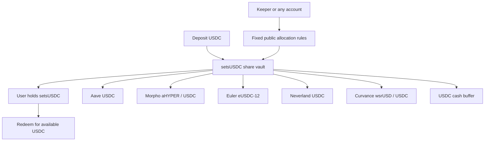

# setsUSDC: five protocols, including Curvance

**Codex implementation and handoff · 8 October 2026.** Curvance's adapter is implemented, deployed and tested on the local Monad fork. This supersedes the earlier “adapter pending” research status. Claude has not yet reviewed this contribution.

The current demo is **http://127.0.0.1:3015/app/**. Select **USDC** in the Earn card’s asset dropdown, then **Try the local demo account**. Its five destinations are Aave, Morpho, Euler, Neverland and Curvance. The displayed balances, rates, allocation and transaction execution all use the same fork with synthetic funds.

## SAM-style architecture



One underlying asset, one receipt token, fixed protocol adapters and permissionless execution remain the design. Curvance is the **fifth protocol**, not four extra protocols because it has multiple markets. The allocator uses bounded live rate observations. Historical learned-yield allocation and reward-token harvesting are not implemented. setsMON remains separate; Perpl still uses AUSD.

## Curvance destination and adapter

The fixed destination lends native USDC against **wsrUSD borrower collateral**. Setsuna does not borrow or post its receipt tokens as collateral. The wsrUSD collateral adds its own issuer, strategy, oracle and liquidation dependencies.

| Item | Address |
|---|---|
| Native USDC | `0x754704Bc059F8C67012fEd69BC8A327a5aafb603` |
| Curvance cUSDC | `0x7f779f7F5316F6164dC5a25422A5ee51504B284A` |
| Market manager | `0x27a4fC8aa36d0ae896C85E8a34e80Fa061E8b4c4` |
| Central registry | `0x1310f352f1389969Ece6741671c4B919523912fF` |
| Reviewed IRM | `0xAd22787690DBBbBD70F8081F5293ee5a88Be4cec` |

`CurvanceUSDCAdapter` verifies asset decimals, underlying, registry, manager, listing and linked IRM on construction. Its vault, market and initial IRM cannot be replaced. A changed IRM blocks new deposits and rate quotes while retaining the withdrawal path. Mint pauses block deposits; a redemption pause blocks new exposure and reports zero protocol withdrawal liquidity. Actual token cash further bounds Curvance's reported available cash. Idle adapter USDC is returned to the vault on sync.

The adapter calls `accrueIfNeeded()` before settlement. Setsuna refreshes all adapters before pricing deposits, redemptions or rebalances. This matters because Curvance's view conversion includes pending vesting but does not reflect every fee-share dilution or a later accrual-period rollover. Display quotes can differ from refreshed settlement; the app's minimum-output limits still apply.

The annual supply-rate estimate uses the lower of the active vesting borrow rate and `predictedBorrowRate(postAllocationCash, debt)`, then applies utilization, Curvance's interest fee and 365 days. It does **not** use the frontend-only `supplyRate()` or `borrowRate()` functions. Rates exclude incentives and are estimates, not guaranteed or realized returns.

Deposits approve only the exact amount and clear the approval afterward. Withdrawals verify exact USDC delivery and redeem the entire cToken balance when withdrawing its full refreshed claim. Only the linked vault can move funds or call adapter sync.

## Deployment and limits

Source block **111560409**, hash `0xc8a3dcf05b4b35daf91e0abc74bc91ebc2ec45830d93a8f2b6451cff8214a84b`, timestamp `1791447513`.

`SetsunaMultiEarnCore` now accepts two through five fixed adapters. `SetsunaUSDCV2Factory.createFiveProtocolVault()` creates the new configuration atomically. `createVault()` retains the four-destination configuration. Existing deployed vaults and their users are not migrated or modified. Deployment manifests, validation, public keeper and UI accept both versions and check every adapter's asset/vault link.

Limits remain: 25,000-USDC vault cap; 250,000-USDC market size floor; 10% cash target; 60% NAV and 10% market-cash destination caps; 10% gross movement per rebalance; ten-minute cooldown; spaced rate observations and rate-spread checks. Withdrawals depend on available liquidity. No swaps, leverage, withdrawal queue or arbitrary executor destinations were added.

Compiled factory initcode including constructor arguments is **45,500 bytes**, below EIP-3860's 49,152-byte limit. Vault runtime is **16,911 bytes**, below EIP-170's 24,576-byte limit. No contract-size limits were disabled.

```sh
npm run usdc:demo:five
# Separate terminal:
npm run dev:usdc-five
# With both running:
npm run check:usdc-five
```

This isolated demo uses RPC **18613**, UI **3015**, and `.local/setsusdc-five/`. The older four-protocol demo remains on 18612/3014. Each start refuses to overwrite an occupied RPC port. `demo.json` contains public deployment details; `keeper.env` contains a private local executor key and must not be published. Stop the demo's launcher to stop its owned fork and keeper.

## Verification

**152 Solidity tests passed, zero failed or skipped**, including ten five-protocol fork tests. Four integration tests allocate to all five real protocols, partially/fully redeem, accrue interest over seven simulated days, disable Curvance and exit, and compare projected rates with actual deposits. Six additional tests exercise pause state, changed IRM, actual cash limits, mint/valuation failures, authority, donations, allowance cleanup and incorrect venue identity, using mocked reads where needed for fault injection. Legacy setsMON, USDC, Spot and Perps regressions also pass.

**18 keeper/configuration tests, TypeScript and the production build passed.** The signed browser journey passed exact approval, a 100.25-USDC deposit, public rate observation and rebalance, partial/full redemption, reload and mobile width, with no page errors. It asserts five protocol rows plus cash and a funded Curvance position. The continuously running keeper then independently confirmed a five-destination cash-buffer repair, consuming 1,714,319 gas; its receipt is included in the evidence.

The 1,000-USDC integration fixture allocated approximately 151.608226 to Aave, 261.265479 to Morpho, 225.484222 to Euler, 104.153912 to Neverland and 157.494159 to Curvance, retaining the balance as cash. After withdrawing 400 USDC, final redemption returned 600.006667. A separate seven-day simulation redeemed 1,000.927648. These are controlled synthetic-fund fork outcomes, excluding gas, not customer earnings or forecasts.

[Deployment, transaction hashes, test scope, source hashes and compiled sizes](research/usdc-five-2026-10-08.json). Browser screenshots are in `.local/setsusdc-five/browser/`.

## Claude handoff and remaining scope

Keep Curvance's **wsrUSD / USDC** identity visible and use the connected deployment's actual adapter count. Preserve the distinction between estimated APR, refreshed share value and realized performance. A rate, pause or valuation failure must not be hidden with invented balances or live-mainnet quotes.

TownSquare remains excluded because its screened USDC pool is below the market-size floor, even though its direct same-chain deposit/withdrawal probe works. This delivery completes Curvance locally. Tenderly/public worker hosting, a shared public demo deployment, security review and a realized-performance ledger remain separate work. The public site has not been redeployed.
