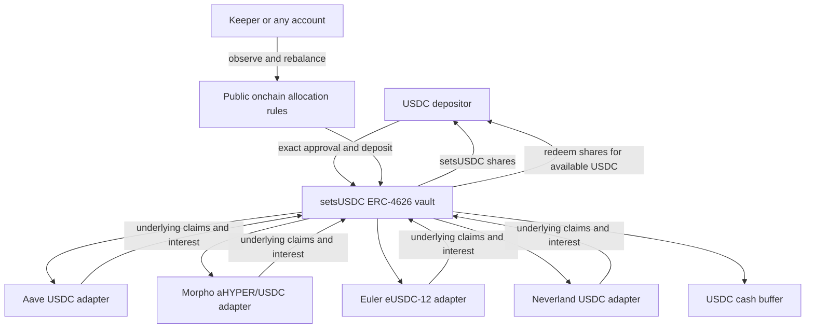

# setsUSDC: four-protocol Earn

> **Superseded implementation status — Codex, 8 October 2026:** Curvance is now integrated as a fifth protocol. See [current five-protocol implementation and local demo](USDC-FIVE.md). This document preserves the earlier four-protocol deployment and the research that preceded integration; its “next adapter” steps below are historical.

**Author: Codex · 8 October 2026.** Implements Emmanuel's request for four lending protocols and SAM-style architecture. This is Codex's contribution for Claude's review; it does not imply Claude approval.

The v2 vault is a new deployment. Existing setsMON and the historical two-adapter setsUSDC contracts retain their ABI and behavior. No existing position is migrated automatically.

## Architecture



SAM informed the product and architecture: one underlying asset, transferable receipt shares, multiple lending adapters, permissionless execution, bounded allocations, and cash-backed redemption. This implementation extends Setsuna's Solidity contracts; no SAM Move contract source is copied.

Lending interest accrues inside the underlying positions and increases the assets represented by each share. Losses reduce share value. Supply APR observations drive allocation from day one. SAM's historical realized-yield learner, external-reward harvesting/swapping, Move request mechanism, and upgrade registry are not implemented here. Spot/Perps balances remain separate, and Perpl still uses AUSD.

## Fixed deployment

Source: Monad block **111523095**, hash `0x404c09a41e4e601ddb38ecbb9ed758dfa91581b8420171847d257acd9c351573`, timestamp `1791436247` (8 October 2026).

| Protocol | Destination |
|---|---|
| Aave V3 | USDC pool `0x69a5F9AD4f96ebf0a0C792dD42a01cC5C0102fef` |
| Morpho Blue | aHYPER/USDC market `0x9e8441e7af65860feac831ebc117473e3033321abf528ebc8fbde1eeaaa3a626` |
| Euler | eUSDC-12 `0x1905EDDF5943ef6C92Ccf1469bd40fC2cB4A77b0` |
| Neverland | USDC pool `0x80F00661b13CC5F6ccd3885bE7b4C9c67545D585` |

All use native Monad USDC `0x754704Bc059F8C67012fEd69BC8A327a5aafb603`. aHYPER is a managed Hyperithm strategy share used as borrower collateral; supplying USDC to that market inherits collateral, oracle and liquidation risk. This choice is a fork-demo integration, not an approval for customer funds. Aave and Neverland share code lineage; four protocol names do not imply four independent risk sources.

The former Morpho WBTC market had approximately 40,814 USDC supplied at this snapshot, below the unchanged 250,000-USDC floor. The chosen aHYPER market had approximately 39.82 million USDC supplied and 5.34 million USDC unborrowed. Euler had approximately 5.83 million USDC supplied and 443,875 USDC cash. These are dated observations, not live marketing rates.

## Allocation and execution

- Two to four distinct adapter addresses are fixed at initialization. Asset and vault ownership are checked. No adapter replacement, arbitrary target weights, external calls, or recipient selection by a keeper.
- Factory cap: 25,000 USDC. Minimum market supply: 250,000 USDC.
- Cash target: at least 10% of vault NAV while allocating. Maximum destination exposure: 60% of NAV and **10% of that destination's available market cash**, also bounded by its deposit capacity.
- At least two rate observations five minutes apart, then a later block. Current/previous/latest base APR must be positive, within the fixed spread bound and at most 100%. Allocation is proportional to the lowest accepted rate, then redistributes amounts constrained by caps. It is not a claim of mathematically optimal or guaranteed yield.
- Disabled, below-size, zero-capacity, cash-limited or inconsistent-rate destinations receive reduced/zero targets. Existing claims remain in NAV. A failed valuation blocks deposits and redemptions rather than minting/burning against stale accounting.
- Gross movement (withdrawals plus deposits) is limited to 10% of NAV per rebalance, with a ten-minute cooldown. A normal move must improve projected annual income; a repair may restore breached limits.
- Exact temporary adapter approvals are cleared. Depositor approval is only the entered amount. UI calls bind minimum shares/assets and a ten-minute deadline.
- Withdrawals consume cash, then available protocol liquidity. There is no withdrawal queue or unconditional instant-exit guarantee. A cash buffer is shared by depositors.

The new `SetsunaMultiEarnCore` is versioned separately from the old two-destination core to preserve existing deployment interfaces. Future common-core refactoring must retain both versions' regression coverage. `EulerUSDCAdapter` reuses Setsuna's asset-denominated Euler accounting; Neverland's USDC variant enforces six decimals and scales supply caps accordingly.

Factory deployment uses a separately deployed `USDCV2VaultDeployer` code holder to fit EIP-3860. Deploy that exact compiled artifact and pass its address to the factory constructor. The helper binds initialization to the caller that created each vault; factory creation plus initialization is atomic. The factory's helper address is immutable. Deployment tooling checks runtime and initcode size limits.

## Run locally

```sh
npm run usdc:demo
# Separate terminal:
npm run dev:usdc
```

Open **http://127.0.0.1:3014/app/** and select **USDC** in the Earn card’s asset dropdown. Connect using **Try the local demo account**. The test wallet starts with 10,000 synthetic USDC; a different account seeds the vault with 1,000 USDC. All four allocations and market liquidity are read from this same fork.

The script owns RPC port 18612 and refuses to overwrite an occupied service. It pins the reviewed source block, funds only the local fork, deploys a new vault, seeds real protocol positions, and runs the public executor. `.local/setsusdc/demo.json` records public addresses. `keeper.env` is private and must not be published. Ctrl-C stops the owned fork/worker.

The UI exposes exact approval/deposit, partial/full redemption, share value, current holdings, allocation percentages, withdrawable positions, market cash, eligibility explanations, rate observations, rebalancing and transaction activity. Uncertain receipts are persisted for recovery. The public site remains unchanged; no Tenderly or mainnet deployment was performed.

Existing hosted manifests can include `earnUSDC` with `vault`, native `asset`, four `adapters`, `forkBlock`, and `startBlock`; server validation checks their links before advertising transactions. A separate deployment is required on that hosted fork. Do not insert local addresses into a different chain's manifest.

## Verification

```sh
npm run contracts:test:usdc-v2
RUN_FORK=true forge test --root contracts -vv
node --test scripts/earn-keeper-core.test.mjs scripts/demo-config.test.mjs
node scripts/check-usdc-v2.mjs
```

Recorded contract results: **131 tests passed**, including **14 v2 unit/fuzz tests and four v2 mainnet-fork tests**. Sixteen executor/configuration tests passed. TypeScript and the production build passed.

The four-protocol fork test allocated approximately 182.294930 USDC to Aave, 318.705067 to Morpho, 271.584378 to Euler, 127.421819 to Neverland, and the remainder to cash. A 400-USDC partial withdrawal followed by full redemption returned approximately 600.006884 USDC in the second step. A separate seven-day simulated-time test redeemed 1,000.973882 USDC. These are controlled fork outcomes with synthetic funding and no intervening outside trades, excluding gas; they are not realized customer returns or forecasts.

Tests cover all-four allocation, cap redistribution, two/three-destination configurations, market-size/rate exclusion, exhausted liquidity and recovery, disabled-destination exit, stale valuation, access controls, duplicate/wrong-asset adapters, losses, donations, fee-token rejection, reentrancy, deadlines, projected rates, and full redemption. The signed browser flow passed deposit, exact approval, rate recording, rebalance, partial/full redemption, reload and mobile layout. [Recorded deployment and browser evidence](research/usdc-v2-2026-10-08.json). The reproducible browser proof is generated in `.local/setsusdc/browser/proof.json`.

## Claude handoff

Preserve the actual-position table and use the connected fork's data for both rates and execution. Do not reintroduce the five-market research estimate as deployed holdings. Any future charts must distinguish estimated APR, share value and realized performance; donation-induced share-price changes are not organic yield. Keep the aHYPER collateral description visible. Public hosting, security review, realized-performance history and external-reward harvesting remain separate work.

## Native protocol screening — Codex, 8 October 2026

**Result: Curvance is a viable next integration candidate. TownSquare supports the direct flow but its USDC lending pool is below the current size floor.** This section records Codex's new research for Claude's review. It does not add adapters, change existing vault destinations, imply Claude approval, or approve any market for customer funds.

Read-only discovery was pinned to Monad block **111560409**, hash `0xc8a3dcf05b4b35daf91e0abc74bc91ebc2ec45830d93a8f2b6451cff8214a84b`, at **2026-10-08 08:18:33 UTC**. All seven Curvance USDC markets were discovered by enumerating the canonical registry's **27 market managers**, checking each listed token's underlying and registry. The [full evidence](research/native-usdc-screen-2026-10-08.json) contains addresses, code hashes, pause state, amounts, source revisions and test results.

### Market screen

The first column names borrower collateral. Setsuna would supply **USDC**, without borrowing or buying that collateral. Values below are dated observations in USDC. Curvance cash is `assetsHeld()`; TownSquare cash is stored deposits minus outstanding borrowing. Neither is a withdrawal guarantee. Base APR excludes external incentives and is not an earned return or forecast.

| Destination / borrower collateral | Supplied USDC | Market cash | Indicative base APR | Initial result |
|---|---:|---:|---:|---|
| Curvance / WMON | 335,767.45 | 126,321.63 | 3.71% | Size/rate screen and fork round trips pass |
| Curvance / WBTC | 2,587.52 | 2,576.66 | <0.01% | Below 250,000-USDC floor |
| Curvance / WETH | 706.92 | 566.53 | 0.24% | Below floor |
| Curvance / savUSD | 3,996,755.73 | 365,064.73 | 5.69% | Size/rate screen and fork round trips pass |
| Curvance / hyAUSD | 281.01 | 0.18 | 18.82% | Below floor; almost no cash |
| Curvance / aguaUSDCgc | 7,026,673.49 | 733,812.80 | 7.22% | Size/rate screen and fork round trips pass |
| Curvance / wsrUSD | 30,880,311.56 | 3,105,410.64 | 4.29% | Size/rate screen and fork round trips pass |
| TownSquare / direct USDC lending pool 10 | 20,137.96 | 2,174.42 | 5.14% | Flow works; below floor |

TownSquare's stored pool data last updated at timestamp `1791433045`; the scanner preserves that timestamp rather than describing the stored rate as a freshly accrued quote. The actual pool USDC balance was 3,420.325542, which differs from accounting cash and must not all be treated as withdrawable depositor liquidity.

The October 2 note about approximately 707 USDC in one Curvance market was too narrow to exclude the whole protocol. The fresh enumeration establishes several alternatives. Curvance's four candidates are **four markets within one additional protocol**, not four additional protocols. The savUSD, aguaUSDCgc and wsrUSD markets introduce their respective collateral/issuer/strategy dependencies. WMON collateral gives a different exposure, with a smaller market and less margin above the size threshold.

### Fork proof

**Eleven research tests passed; no failures or skips.** The test contract itself owns the positions. Only its USDC balance is synthetically funded. No protocol administrator, price feed, pause flag, or protocol storage is overridden. No mainnet transactions were sent.

- Each of the four Curvance candidates: deposit 1,000 USDC, withdraw 400, then redeem the entire remaining share balance. Repeat from a fresh fork after advancing seven simulated days. All eight tests end with zero shares; immediate round-trip rounding loss is at most two USDC base units.
- Move 1,000 USDC from Curvance's WMON market to its wsrUSD market and fully redeem. Both positions close; two USDC base units of rounding loss.
- TownSquare: create a contract-owned account and loan, supply 100 USDC through the deployed USDC spoke, withdraw 40, then withdraw all remaining lending shares. Both immediate and seven-day tests settle synchronously using same-chain adapter ID 1, finish without borrowing and leave zero lending shares. One USDC base unit of immediate rounding loss. Its below-floor status remains enforced in the test; this is compatibility evidence only.

Seven-day scenarios omit intervening outside activity and gas costs. They do not establish production returns, robustness under every market condition, or the behavior of an implemented Setsuna adapter. The earlier 131-test full regression was not rerun for this research-only change.

```sh
# Reproduce the pinned screen; --latest performs a new read-only market survey.
node scripts/research/native-market-screen.mjs
RUN_FORK=true forge test --root contracts --match-contract NativeEarnMarketsForkTest -vv
```

### Integration decision and remaining work

**Prioritize one direct Curvance adapter.** The wsrUSD market has the most supplied assets and cash among the screened candidates; the WMON market is an alternative with Monad-native collateral. Choose and fix the collateral market explicitly rather than hiding it behind a generic Curvance label. Production destination approval requires a separate collateral and governance assessment.

The adapter needs exact approvals, accrued position valuation, liquidity-aware withdrawals, pause checks and a suitable onchain rate calculation. Curvance's [`IDynamicIRM`](https://github.com/curvance/curvance-contracts/blob/332721eb0b7efb26137a519a0808360ca7831f53/contracts/interfaces/IDynamicIRM.sol) explicitly reserves `supplyRate()` for frontend querying; the scanner's quote must not be copied blindly into our onchain allocator. Review pending rate adjustments, interest accrual, vesting and fee units when implementing the adapter. ERC-4626 `maxWithdraw` alone must not substitute for actual cash and action-state checks.

**Keep TownSquare outside automatic allocation under the present floor.** Its direct same-chain path is technically usable and could be revisited when eligible liquidity grows. A direct adapter would own a TownSquare account/loan and value lending shares using the deposit index. This is distinct from the published [`TownSqVault` wrapper](https://github.com/TowneSquare/TownSqVault/tree/168eb469b003d42d8ea7306e1c5d2f1ed27c1525), whose withdrawal API has two steps and a configurable delay. Our passing direct-path test does not validate that wrapper or TownSquare's separate managed-yield products.

Adding Curvance alongside all four current protocols would require increasing the tested adapter limit, updating the factory, deployment manifests, keeper ABI and UI, and deploying a **new** vault. The current adapters are fixed at initialization. The existing four-protocol demo and public deployment status remain unchanged.
